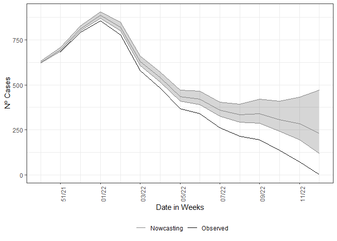
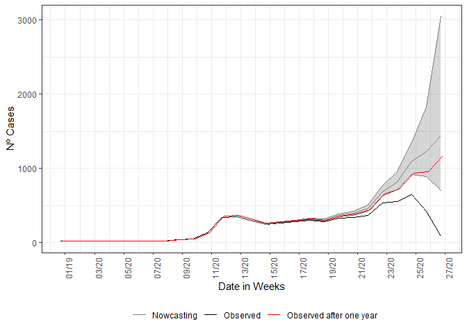

# nowcaster <a href='https://github.com/covid19br/nowcaster'></a> <a href='https://github.com/covid19br/nowcaster'></a>

<!-- badges: start -->
<!-- [](https://cran.r-project.org/web/checks/check_results_nowcaster.html) -->
<!-- [](https://cran.r-project.org/package=nowcaster) -->

[](https://github.com/nowcaster)
[-blue.svg)](https://github.com/covid19br/nowcaster/blob/main/LICENSE.md)
[](https://lifecycle.r-lib.org/articles/stages.html#experimental)
<!-- badges: end -->

`nowcaster` is a R package for “nowcasting” epidemiological time-series.
Every single system of notification has an intrinsic delay, `nowcaster`
can estimate how many counts of any epidemiological data of interest
(*i.e.*, daily cases and deaths counts) by fitting a negative binomial
model to the time steps of delay between onset date of the event,
(*i.e.*, date of first symptoms for cases or date of occurrence of
death) and the date of report (*i.e.*, date of notification of the case
or death).

`nowcaster` is based on the
[`R-INLA`](https://becarioprecario.bitbucket.io/inla-gitbook/index.html)
and
[`INLA`](https://inla.r-inla-download.org/r-inla.org/doc/inla-manual/inla-manual.pdf)
packages for “**I**ntegrated **N**ested **L**aplace **A**pproximation”
algorithm to Bayesian inference. `INLA` is a fast alternative to others
methods for Bayesian inference like **MCMC**. An introduction to `INLA`
can be found
[here](https://becarioprecario.bitbucket.io/inla-gitbook/index.html).

`nowcaster` is build for epidemiological emergency use, it was
constructed for the Brazilian Severe Acute Respiratory Illness (SARI)
surveillance database (SIVEP-Gripe).

## Installing

To install `nowcaster` package simply run the code below in R:

``` r
if( !require(nowcaster, quietly = T) ){
  devtools::install_github("https://github.com/covid19br/nowcaster")
}
```

After installing you can load the by typical library:

``` r
library(nowcaster)
```

## First example on LazyData

When the package is loaded it disponibilize a LazyData file, `sariBH`,
it is a annonymized records of Severe Acute Respiratory Illness notified
in the city of Belo Horizonte, since March 2020 to April 2022. To load
it basically write:

``` r
# Loading Belo Horizonte SARI dataset
data(sragBH)
```

And we take a look on the data:

``` r
head(sragBH)
```

    ## # A tibble: 6 x 7
    ##   DT_SIN_PRI DT_DIGITA  CLASSI_FIN EVOLUCAO CO_MUN_RES Idade fx_etaria
    ##   <date>     <date>          <dbl>    <dbl>      <dbl> <dbl> <fct>    
    ## 1 2020-02-11 2020-03-05          4        1     310620    59 50 - 59  
    ## 2 2020-01-21 2020-02-06          4        1     310620    79 70 - 79  
    ## 3 2020-03-30 2020-04-17          4        1     310620    72 70 - 79  
    ## 4 2020-03-26 2020-04-02          4        1     310620    82 80 +     
    ## 5 2020-03-20 2020-04-13          4        1     310620    50 50 - 59  
    ## 6 2020-04-07 2020-04-22          5        1     310620    74 70 - 79

It is a data.frame with 7 variables and 65,404 observations. We will
make use of only the first two columns, “DT_SIN_PRI” (date of onset
symptoms) and “DT_DIGITA” (recording date) as well the column “Idade”
(age in years) to make age structured nowcasting.

## Non-structured data

Now we call the nowcasting function, it has by default the
parametrization to take the data and estimate with a non-structured data
form. The estimate fits a negative binomial distribution,
"),
to the cases count at time

with delay
,

is the dispersion parameter. The rate

is then parameterized in a log-linear format by a constant term added by
structured delay random effects and structured time random effects.
Hence, the model is given by the following:

, \\
\log(\lambda_{t,d}) = \alpha + \beta_t + \gamma_d, \\
t=1,2,\ldots,T, \\ d=1,2,\ldots,D,
\end{equation}")

where the intercept

follows is Gaussian distribution with a very large variance,

is follows a second order random walk with precision
,

a first-order random walk with precision
.
The model is then completed by INLA default prior distributions for
,
,
and
.
See nbinom, rw1 and rw2 INLA help pages.

The call of the function is straightforward, it simply needs a dataset
as input, here the `LazyData` loaded in the namespace of the package.
The function has 3 mandatory parameters, `dataset` for the parsing of
the dataset to be nowcasted, `date_onset` for parsing the column name
which is the date of onset of symptoms and `date_report` which parses
the column name for the date of report of the cases. Here this columns
are “DT_SIN_PRI” and “DT_DIGITA”, respectively.

``` r
nowcasting_bh_no_age <- nowcasting_inla(dataset = sragBH, 
                                        date_onset = DT_SIN_PRI, 
                                        date_report = DT_DIGITA, 
                                        data.by.week = T)
head(nowcasting_bh_no_age$total)
```

    ## # A tibble: 6 x 7
    ##    Time dt_event   Median    LI    LS   LIb   LSb
    ##   <int> <date>      <dbl> <dbl> <dbl> <dbl> <dbl>
    ## 1    17 2021-12-13    625   621  632   623    627
    ## 2    18 2021-12-20    695   687  707.  692    699
    ## 3    19 2021-12-27    812   801  831   808    817
    ## 4    20 2022-01-03    887   871  907   881    893
    ## 5    21 2022-01-10    819   800  845.  812    826
    ## 6    22 2022-01-17    632   610  660   624.   641

This calling will return only the nowcasting estimate and its Confidence
Interval (CI) for two different Credible interval, `LIb` and `LSb` are
the max and min CI, respectively, with credibility of 50% and `LI` and
`LS` are the max and min CI, respectively, with credibility of 95%.

`nowcasting_inla` has the option to return the curve for when the
nowcasting estimate was set the window of action of the model, if the
`data.by.week` parameter is flagged as `TRUE` it returns on the second
element of the output list the summarized data by week.

``` r
library(ggplot2)
library(dplyr)

dados_by_week <- nowcasting_bh_no_age$data |> 
  filter(date_onset >= (Sys.Date()-270)) |> 
  group_by(date_onset) |> 
  summarise(n = n())

dados_by_week |> 
  ggplot()+
  geom_line(data = dados_by_week, aes(date_onset, y = n, col = 'Observed'))+
  theme_bw()+
  theme(legend.position = "bottom", axis.text.x = element_text(angle = 90)) +
  scale_color_manual(values = c('grey50', 'black'), name = '')+
  scale_x_date(date_breaks = '2 weeks', date_labels = '%V/%y', name = 'Date in Weeks')+
  labs(x = '', y = 'Nº Cases')
```

<!-- -->

After this element is groped by and summarized by the onset of symptoms
date, here `DT_SIN_PRI`, it is the epidemiological curve observed. To
example how the estimate compares with the observed curve, we plot the
estimate and the epidemiological curve all together.

``` r
nowcasting_bh_no_age$total |> 
  ggplot(aes(x = dt_event, y = Median, col = 'Nowcasting')) +
  geom_line(data = dados_by_week, aes(date_onset, y = n, col = 'Observed'))+
  geom_ribbon(aes(ymin = LI, ymax = LS, col = NA), alpha = 0.2, show.legend = F)+
  geom_line()+
  theme_bw()+
  theme(legend.position = "bottom", axis.text.x = element_text(angle = 90)) +
  scale_color_manual(values = c('grey50', 'black'), name = '')+
  scale_x_date(date_breaks = '2 weeks', date_labels = '%V/%y', name = 'Date in Weeks')+
  labs(x = '', y = 'Nº Cases')
```

<!-- -->

This is an example were the estimate was done without considering any
type of strucuture in data, which is the first assumption for the
nowcasting.

## Nowcasting as a tool to support decision making

Nowcasting a rising curve or a curve on any other moment can give
quantitative support for decision making, during the public health
crises, the most needed is a way to anticipate, at least, what it is
happening at the moment. Nowcasting is the tool for this type of
questioning and can gives insights on the data to support nedded
decisions.

We start this section by cutting the original data at a moment of
apparent decaying of the SARI hospitalisation, for the city of Belo
Horizonte, which had a prompt starting response to the Covid=19
pandemic. The pressure on the health system took more time than the rest
of the country, and the data at same time were showing a decay. We
filter all cases entered until 4th of July of 2020 by the date of
digitasation, a date that the cases shows up in the database.

``` r
library(tidyverse)
library(lubridate)

## To see Nowcasting as if we were on the verge of rise in the curve
srag_now<-sragBH |> 
  filter(DT_DIGITA <= "2020-07-04")

data_by_week<-data.w_no_age(dataset = srag_now, 
                         date_onset = DT_SIN_PRI, 
                         date_report = DT_DIGITA) |> 
  group_by(date_onset) |> 
  tally()

data_by_week |>  
  ggplot(aes(x = date_onset, 
             y = n))+
  geom_line()+
  theme_bw()+
  labs(x = 'Date of onset of symptons', y = 'Nº Cases')+
  scale_color_manual(values = c('grey50', 'black'), name = '')+
  scale_x_date(date_breaks = '2 weeks', date_labels = '%V/%y', name = 'Date in Weeks')
```

<!-- -->

On this filtered data, we estimate the cases already that started its
date of onset of symptons but were not yet reported, so there not in the
database. We just pass to the `nowcasting_inla` function, the dataset
filtered, flag for the columns where are the `date_onset` and
`date_report`, we add the flag for the function return back the epidemic
curve by epiweek.

``` r
nowcasting_bh_no_age <- nowcasting_inla(dataset = srag_now, 
                                        date_onset = DT_SIN_PRI, 
                                        date_report = DT_DIGITA, 
                                        data.by.week = T)
head(nowcasting_bh_no_age$data)
```

    ## # A tibble: 6 x 3
    ##   date_report date_onset Delay
    ##   <date>      <date>     <dbl>
    ## 1 2020-02-29  2020-02-08     3
    ## 2 2020-02-01  2020-01-18     2
    ## 3 2020-04-11  2020-03-28     2
    ## 4 2020-03-28  2020-03-21     1
    ## 5 2020-04-11  2020-03-14     4
    ## 6 2020-04-18  2020-04-04     2

Before we see the result of the nowcasting estimate we take a look on
intermediate part of the process of nowcasting, the delay triangle,
which sets the objects for nowcasting. The delay triangle is only a
table where each unique amount of delay, (i.e. integer numbers of days
or weeks) has passed between date of onset and date of report spread
over each date of onset. The part that is closer to the present has less
counts and has a lower amount of delay, this trivial due to, as the
system takes time to process the cases, the most newer cases are lesser
than the older ones, that already time to be processed.

From the data in weekly format we mount the counts of cases by the
amount of delay. By tabling the delay amount against the data of onset
of first symptoms, to see the pattern of the delay for the cases.

``` r
data_triangle <- nowcasting_bh_no_age$data |> 
  filter(Delay < 30) |> 
  arrange(desc(Delay))
delay_triangle<-table(data_triangle$date_onset, 
                      rev(data_triangle$Delay),
                      dnn = list("Date of Onset", "Delay"))
head(delay_triangle)
```

    ##              Delay
    ## Date of Onset  0  1  2  3  4  5  6  7  8  9 10 11 12 13 14 15 16 17 18 19 20
    ##    2019-12-28  5 13  1  1  0  0  0  1  0  0  0  0  0  0  0  0  0  0  0  0  0
    ##    2020-01-04  3 15  1  0  0  1  0  0  0  0  0  0  0  0  0  0  0  0  0  0  0
    ##    2020-01-11  1 13  4  1  0  0  0  0  0  0  1  0  0  0  0  0  0  0  0  0  0
    ##    2020-01-18  5 17  3  0  0  0  0  0  0  0  1  0  0  0  1  0  0  0  0  0  0
    ##    2020-01-25  5  7  5  1  0  0  0  0  0  0  0  0  0  0  0  0  0  0  0  0  0
    ##    2020-02-01  3 12  3  1  0  0  0  0  0  0  0  1  0  0  0  0  0  0  0  0  0

We just look at the amount of cases with 30 weeks of delay or less, it
is the default maximum delay considered at nowcasting estimation. It can
be changed by the parameter `Dmax`.

If this element is grouped by and summarized by the onset of symptoms
date, here `DT_SIN_PRI`, it is the epidemiological curve observed. To
example it, we plot the estimate and the epidemiological curve all
together.

``` r
library(ggplot2)

dados_by_week <- nowcasting_bh_no_age$da %>% 
  group_by(date_onset) %>% 
  summarise(n = n())

nowcasting_bh_no_age$total |> 
  ggplot(aes(x = dt_event, y = Median, col = 'Nowcasting')) +
  geom_line(data = dados_by_week, aes(date_onset, y = n, col = 'Observed'))+
  geom_ribbon(aes(ymin = LI, ymax = LS, col = NA), alpha = 0.2, show.legend = F)+
  geom_line()+
  theme_bw()+
  theme(legend.position = "bottom", axis.text.x = element_text(angle = 90)) +
  scale_color_manual(values = c('grey50', 'black'), name = '')+
  scale_x_date(date_breaks = '2 weeks', date_labels = '%V/%y', name = 'Date in Weeks')+
  labs(x = '', y = 'Nº Cases')
```

<!-- -->

And as expected, the nowcasting estimated a rising on curve when it were
observed a decaying. Adding to the plot what actually has happened in
that period, with the data inserted posterioly the period for when the
nowcasting estimated the rising in the curve for SARI hospitalizations.

``` r
nowcasting_bh_no_age$total %>% 
  ggplot(aes(x = dt_event, y = Median, col = 'Nowcasting')) +
  geom_line(data = dados_by_week, aes(date_onset, y = n, col = 'Observed'))+
  geom_ribbon(aes(ymin = LI, ymax = LS, col = NA), alpha = 0.2, show.legend = F)+
  geom_line()+
  geom_line( data = sragBH %>%
               filter(DT_SIN_PRI <= "2020-07-04") %>% 
               mutate(
                 D_SIN_PRI_2 = DT_SIN_PRI - as.numeric(format(DT_SIN_PRI, "%w"))
               ) %>% 
               group_by(D_SIN_PRI_2) %>% 
               tally(), 
             mapping = aes(x = D_SIN_PRI_2, y = n, 
                           color = "Observed after one year")) + 
  theme_bw() +
  theme(legend.position = "bottom", axis.text.x = element_text(angle = 90)) +
  scale_color_manual(values = c('grey50', 'black', 'red'), 
                     name = '')+
  scale_x_date(date_breaks = '2 weeks', date_labels = '%V/%y', name = 'Date in Weeks')+
  labs(x = '', y = 'Nº Cases')
```

<!-- --> This end the
first simple example when estimating the already started events but not
yet reported (i.e. nowcasting). The relevance of nowcasting for public
health decision is given by the understading that what is present on the
databases are only a picture of the real time situation. The above graph
can help policy makers on what decisions takes in the face of a rising
curve of hospitalisations.

## Structured data, Age

For the structured data the `nowcasting_inla()` fits again a Negative
binomial distribution to the cases count at time

with delay
.
Differently, from the non-structured case the model now gives random
effects to the delay distribution and and time distribution by each of
the age-class chosen by the user to break the data. The model has the
form now:

, \\
\log(\lambda_{t,d,a}) =  \alpha_a + \beta_{t,a} + \gamma_{d,a}, \\ \quad t=1,2,\ldots,T, \\ d=1,2,\ldots,D, \\ a=1,2,\ldots,A, \end{equation}")

where each age class,
,
has an intercept

following a Gaussian distribution with a very large variance, the
time-age random effects,
,
follow a joint multivariate Gaussian distribution with a separable
variance components an independent Gaussian term for the age classes
with precision

and a second order random walk term for the time with precision
.
Analogously, the delay-age random effects,
,
follow a joint multivariate Gaussian distribution with a separable
variance components an independent Gaussian term for the age classes
with precision

and a first order random walk term for the time with precision
.
The model is then completed by INLA default prior distributions for
,
,
,

and
.
See nbinom, iid, rw1 and rw2 INLA help pages.

This new model corrects the delay taking into account the effects of age
classes and the interactions of each age class between time and also
delay. Now the model needs a flag indicating which is the column on the
dataset which will be used to break the data into age classes and how
the age classes will be split. This is given by the parameters `age_col`
and `bins_age`. We pass three additional parameters, `data.by.week` to
return the epidemiological curve out of window of action of nowcasting
estimate and `return.age` to inform we desire a nowcasting result in two
ways, the total aggregation estimate and the age-stratified estimate.
The calling of the function has the following form:

``` r
nowcasting_bh_age <- nowcasting_inla(dataset = sragBH, 
                                     bins_age = "10 years",
                                     data.by.week = T, 
                                     date_onset = DT_SIN_PRI, 
                                     date_report = DT_DIGITA,
                                     age_col = Idade)
```

Each of the estimates returned by `nowcasting_inla` has the same form as
in the non-structured case. On the nowcasting estimates, it returns a
data.frame with the posterior edian and 50% and 95% credible intervals,
(LIb and LSb) and (LI and LS) respectively.

``` r
library(ggplot2)

dados_by_week <- nowcasting_bh_age$data |>  
  filter(date_onset >= (Sys.Date()-270)) |>  
  group_by(date_onset) |> 
  summarise(n = n())


nowcasting_bh_age$total %>% 
  ggplot(aes(x = dt_event, y = Median, col = 'Median'))+
  geom_line()+
  geom_line(data = dados_by_week, aes(date_onset, y = n))+
  geom_ribbon(aes(ymin = LI, ymax = LS, col = 'IC'), alpha = 0.2)+
  theme_bw()+
  theme(legend.position = "bottom", axis.text.x = element_text(angle = 90))+
  scale_color_manual(values = c('grey90', 'black'), name = '')+
  scale_x_date(date_breaks = '2 weeks', date_labels = '%V/%y', name = 'Date in Weeks')+
  labs(x = '', y = 'Nº Cases')
```

<!-- -->

## Comparing the estimates

We can compare the estimates by each of the strategies, we plot the two
estimates together:

``` r
nowcasting_bh_no_age$total$type <- "No Age structured"
nowcasting_bh_age$total$type <- "Age structured"


nowcasting_bh_total <- nowcasting_bh_age$total |> 
  full_join(nowcasting_bh_no_age$total)

nowcasting_bh_total |> 
  ggplot(aes(x = dt_event, y = Median, col = type))+
  geom_line(show.legend = F)+
  geom_ribbon(aes(ymin = LI, ymax = LS, fill = NULL), alpha = 0,
              show.legend = T)+
  theme_bw()+
  theme(legend.position = "bottom", axis.text.x = element_text(angle = 90))+
  scale_color_manual(values = c('grey60', 'grey90'), name = '')+
  scale_fill_manual(values = c('grey60', 'grey90'), name = '')+
  scale_x_date(date_breaks = '2 weeks', date_labels = '%V/%y', name = 'Date in Weeks')+
  labs(x = '', y = 'Nº Cases')
```

<!-- -->

The estimates gives different CIs, this is due to a better fitting when
considering random effects by age class for the delays at time, this has
to do with the different capability to respond on different ages. This
is an empirical finding of this models.

``` r
sessionInfo()
```

    ## R version 4.1.2 (2021-11-01)
    ## Platform: x86_64-w64-mingw32/x64 (64-bit)
    ## Running under: Windows 10 x64 (build 19042)
    ## 
    ## Matrix products: default
    ## 
    ## locale:
    ## [1] LC_COLLATE=Portuguese_Brazil.1252  LC_CTYPE=Portuguese_Brazil.1252   
    ## [3] LC_MONETARY=Portuguese_Brazil.1252 LC_NUMERIC=C                      
    ## [5] LC_TIME=Portuguese_Brazil.1252    
    ## 
    ## attached base packages:
    ## [1] stats     graphics  grDevices utils     datasets  methods   base     
    ## 
    ## other attached packages:
    ##  [1] lubridate_1.8.0 forcats_0.5.1   stringr_1.4.0   purrr_0.3.4    
    ##  [5] readr_2.1.2     tidyr_1.2.0     tibble_3.1.8    tidyverse_1.3.2
    ##  [9] dplyr_1.0.8     ggplot2_3.3.6   nowcaster_0.2.1
    ## 
    ## loaded via a namespace (and not attached):
    ##  [1] httr_1.4.3          jsonlite_1.7.3      splines_4.1.2      
    ##  [4] tmvnsim_1.0-2       modelr_0.1.8        sn_2.0.1           
    ##  [7] assertthat_0.2.1    BiocManager_1.30.18 rvcheck_0.2.1      
    ## [10] sp_1.4-6            highr_0.9           stats4_4.1.2       
    ## [13] yulab.utils_0.0.5   googlesheets4_1.0.0 cellranger_1.1.0   
    ## [16] yaml_2.2.2          numDeriv_2016.8-1.1 pillar_1.8.1       
    ## [19] backports_1.4.1     lattice_0.20-45     glue_1.6.1         
    ## [22] digest_0.6.29       RColorBrewer_1.1-3  rvest_1.0.2        
    ## [25] colorspace_2.0-3    htmltools_0.5.2     Matrix_1.3-4       
    ## [28] pkgconfig_2.0.3     broom_1.0.0         haven_2.4.3        
    ## [31] scales_1.2.1        tzdb_0.2.0          MatrixModels_0.5-0 
    ## [34] googledrive_2.0.0   generics_0.1.3      farver_2.1.1       
    ## [37] ellipsis_0.3.2      withr_2.5.0         cli_3.1.1          
    ## [40] mnormt_2.0.2        crayon_1.5.1        readxl_1.3.1       
    ## [43] magrittr_2.0.2      evaluate_0.15       badger_0.2.1       
    ## [46] fs_1.5.2            fansi_1.0.3         xml2_1.3.3         
    ## [49] tools_4.1.2         hms_1.1.1           gargle_1.2.0       
    ## [52] lifecycle_1.0.1     reprex_2.0.1        munsell_0.5.0      
    ## [55] compiler_4.1.2      rlang_1.0.5         grid_4.1.2         
    ## [58] rstudioapi_0.13     INLA_21.11.22       labeling_0.4.2     
    ## [61] rmarkdown_2.13      gtable_0.3.0        DBI_1.1.2          
    ## [64] R6_2.5.1            knitr_1.39          fastmap_1.1.0      
    ## [67] utf8_1.2.2          rprojroot_2.0.3     dlstats_0.1.5      
    ## [70] desc_1.4.1          stringi_1.7.6       Rcpp_1.0.7         
    ## [73] parallel_4.1.2      vctrs_0.4.1         dbplyr_2.1.1       
    ## [76] tidyselect_1.1.2    xfun_0.29
